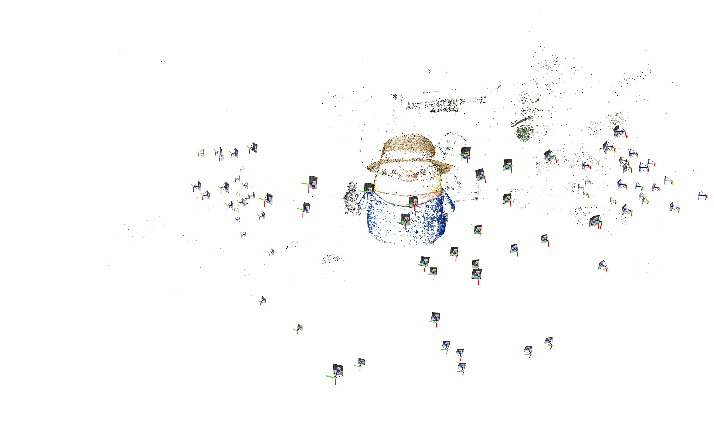
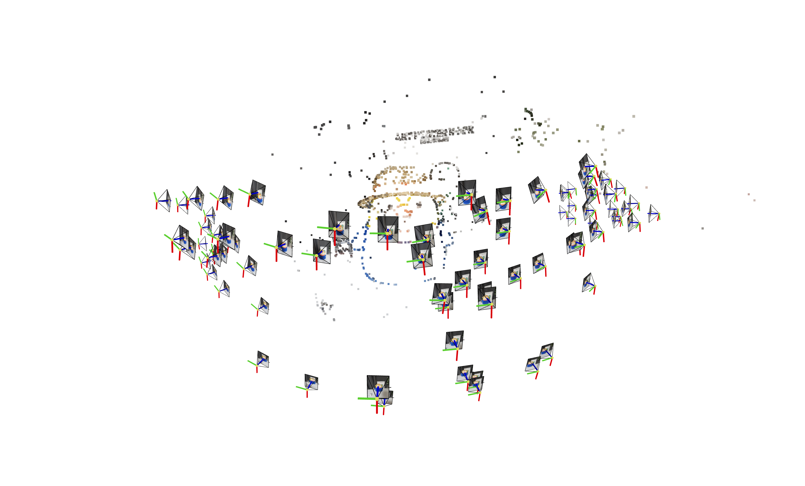

# Radiance Fields from VGGSfM and Mast3r, and Their Comparison

This project aims to explore Gaussian Splatting using two different wild deep-based camera-pose & 3D pointcloud reconstruction methodologies: VGGSfM and Mast3r. 
The objective is to compare their performances and understand the advantages and limitations of each approach.

## Project Structure

- [**VGGSfM**](https://github.com/facebookresearch/vggsfm): Results of (2D) Gaussian Splatting using VGGSfM.
- [**Mast3r**](https://github.com/naver/mast3r): Implementation and results of (2D) Gaussian Splatting using Mast3r.

- Related Blog Post: [Radiance Fields from Deep-based Structure-from-Motion](https://hwan-h-heo.github.io/hwan-h-heo.io/blogs/posts/240721_sfm/post.html)

### Installation 
You should install Viser and plyfile 
```bash
pip install viser==0.1.29
pip install plyfile
```
### Features
- **Convert MASt3R's capability to the COLMAP-compatible format** (in MASt3R installed environment)
   - it saves mast3r results to the COLMAP-compatible cameras/images/points3d
```bash
python colmap_from_mast3r.py --images_dir <path/to/images> --save_dir <path/to/save/colmaps> --model_path <path/to/mast3r/model/ckpt> 
```
- **Online COLMAP results viewer**
   - For visualizing colored VGGSfM point clouds, refer to this: [link](https://github.com/facebookresearch/vggsfm/issues/32) 
```bash
python colmap_vis.py --images_dir <path/to/images> --colmap_path <path/to/colmaps/> 
```

## Results 

I tested on NLE_tower in MASt3R, and my custom data; penguin and guitar. Each dataset includes 5, 10, and 27 images respectively.

**1) COLMAP PointCloud**
| MASt3R | VGGSfM |
| --- | --- |
|  |  |
|  |  |
|  |  |


**2) Radiance Fields Reconstruction**
| MASt3R | VGGSfM |
| --- | --- |
|  | |
|  | |
|  | |


### Summary 
MASt3R is not suitable for inverse rendering but provides denser and more diverse point cloud reconstructions compared to VGGSfM. VGGSfM's accurate camera pose reconstruction, utilizing Bundle Adjustment, makes it more suitable for inverse rendering. Specifically, VGGSfM's camera pose has less than 0.01 angular distance error compared to COLMAP, while MASt3R's pose has over 0.1 angular distance error.

- Both methods are more robust than COLMAP. In my experiment, COLMAP fails to reconstruct all the above datasets. 
- Both methods have shortcomings with limited VRAM capacity, but VGGSfM handles it better. 
   - VGGSfM can reconstruct over 90 images on a single RTX 4090, whereas MASt3R struggles with over 30 images.
     
| COLMAP | VGGSfM |
| --- | --- |
|  |  |

### Further Camera Pose Refinement

As discussed in [InstantSplat](https://arxiv.org/abs/2403.20309) and [issue #2](https://github.com/hwanhuh/Radiance-Fields-from-VGGSfM-Mast3r/issues/2), 
MASt3R (and VGGSfM) poses can serve as a good initial point of the camera pose optimization during radiance fields training (BARF-likes method) .
Below is the toy experiment of MASt3R + further camera pose optimization (Using Splatfacto):

https://github.com/user-attachments/assets/d5b7ba98-7d51-4b20-a81e-6f5e4c00a79d


## About VGGSfM and Mast3r 

###  VGGSfM: Visual Geometry Grounded Deep Structure From Motion
VGGSfM introduces a fully differentiable SfM pipeline, designed to integrate deep learning models into every stage of the SfM process. This method includes:
- End-to-End Differentiability: The pipeline is fully differentiable, allowing for end-to-end training and optimization.
- Superior Camera Reconstruction: Provides highly accurate camera parameter reconstruction, which is beneficial for downstream tasks like neural rendering.
   - Global Optimization: Simultaneously optimizes all camera poses, avoiding the pitfalls of incremental methods.
   - Differentiable Bundle Adjustment (BA): Refines both camera parameters and 3D points to minimize reprojection errors.

### MASt3R: Grounding Image Matching in 3D with MASt3R
MASt3R enhances stereo matching by integrating dense local feature prediction and fast reciprocal matching upon Dust3r baseline. It focuses on leveraging stereo vision to improve 3D point and camera parameter estimation.

- Dense Matching: Excels in dense feature matching, providing detailed 3D reconstructions.
- Attention Mechanism: Utilizes cross-attention between image pairs for robust feature extraction and matching.
- Camera Parameter Reconstruction: Not the primary focus, leading to less accurate camera pose estimations compared to VGGSfM and COLMAP.
