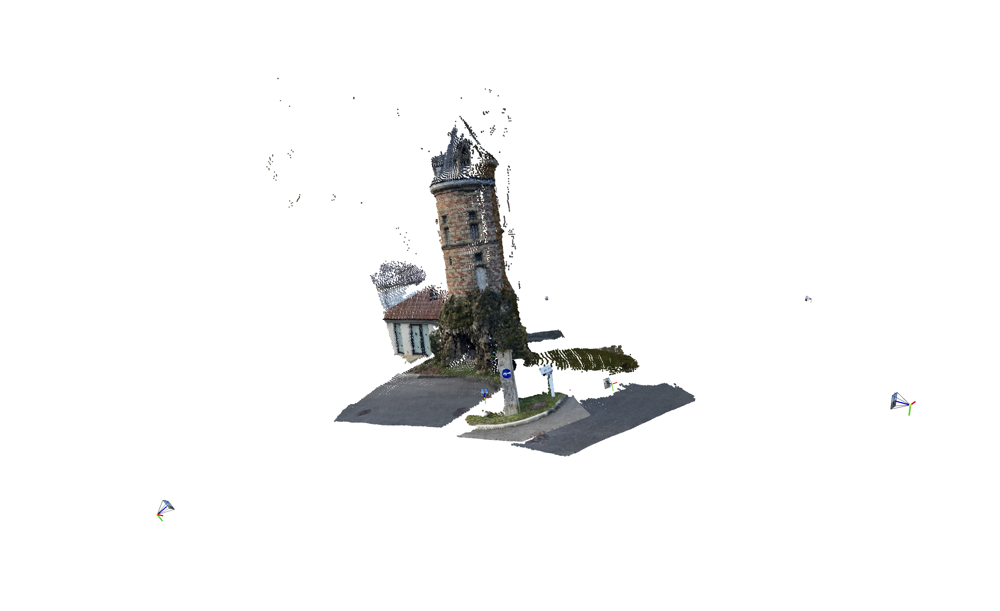
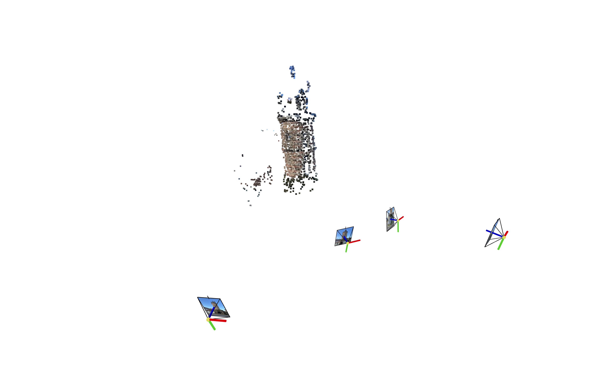
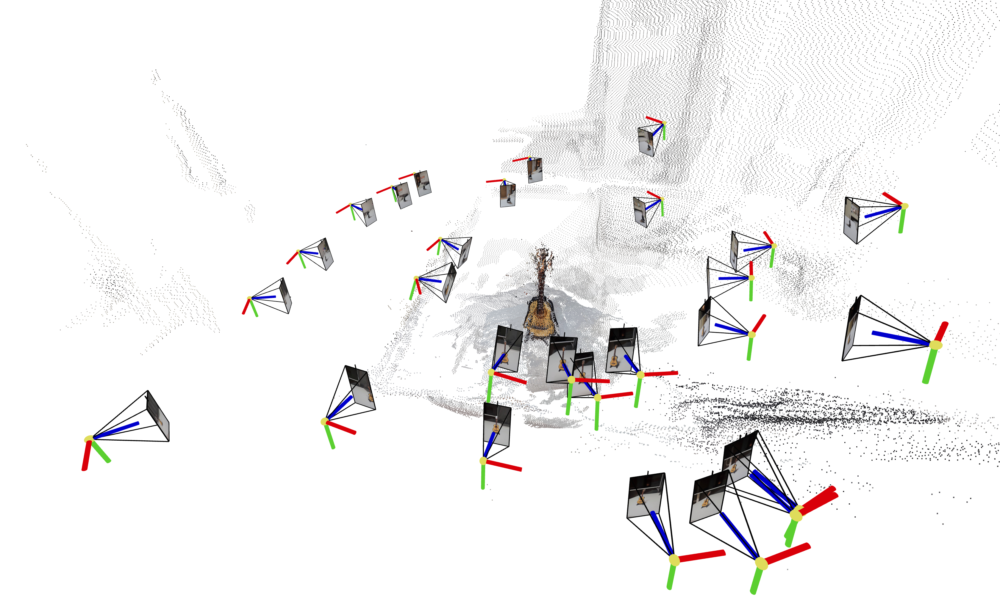
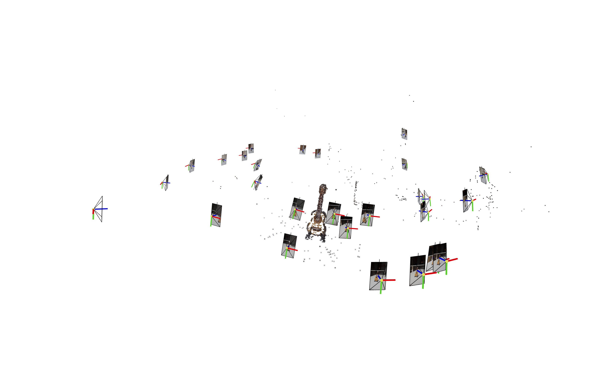
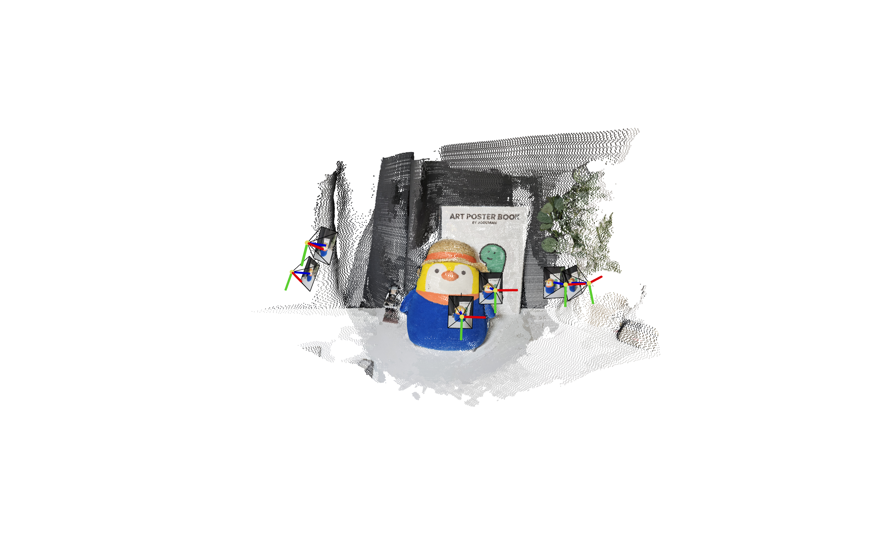
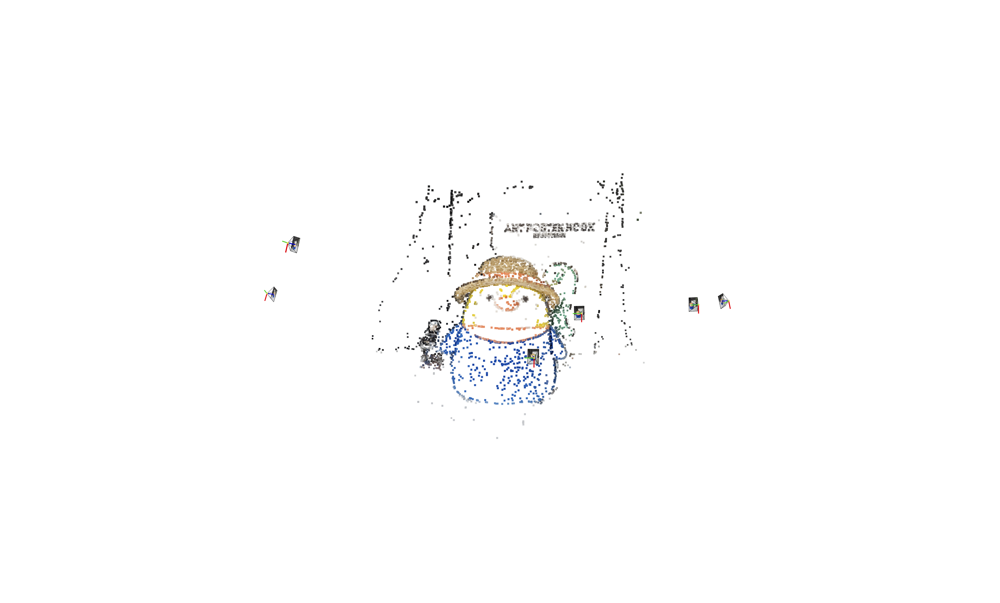

# Gaussian Splatting from VGGSfM and Mast3r, and Their Comparison

This project aims to explore Gaussian Splatting using two different wild deep-based camera-pose & 3D pointcloud reconstruction methodologies: VGGSfM and Mast3r. The objective is to compare their performances and understand the advantages and limitations of each approach.

## Project Structure

- **VGGSfM**: Results of (2D) Gaussian Splatting using VGGSfM.
- **Mast3r**: Implementation and results of (2D) Gaussian Splatting using Mast3r.
- **Comparison**: Detailed comparison of the two methods based on various performance metrics.

## VGGSfM vs Mast3r 

This project uses the following projects:
- [VGGSfM](https://github.com/facebookresearch/vggsfm.git)
- [MASt3R](https://github.com/naver/mast3r.git)

###  VGGSfM: Visual Geometry Group Structure-from-Motion
VGGSfM introduces a fully differentiable SfM pipeline, designed to integrate deep learning models into every stage of the SfM process. This method includes:
- End-to-End Differentiability: The pipeline is fully differentiable, allowing for end-to-end training and optimization.
- Superior Camera Reconstruction: Provides highly accurate camera parameter reconstruction, which is beneficial for downstream tasks like neural rendering.
   - Global Optimization: Simultaneously optimizes all camera poses, avoiding the pitfalls of incremental methods.
   - Differentiable Bundle Adjustment (BA): Refines both camera parameters and 3D points to minimize reprojection errors.

### MASt3R: Grounding Image Matching in 3D with MASt3R
MASt3R enhances stereo matching by integrating dense local feature prediction and fast reciprocal matching upon Dust3r baseline. It focuses on leveraging stereo vision to improve 3D point and camera parameter estimation.

- Dense Matching: Excels in dense feature matching, providing detailed 3D reconstructions.
- Attention Mechanism: Utilizes cross-attention between image pairs for robust feature extraction and matching.
- Camera Parameter Reconstruction: Not the primary focus, leading to less accurate camera pose estimations compared to VGGSfM and COLMAP.

## Qualitative Results Comparison 

**1) PointCloud**
| MASt3R | VGGSfM |
| --- | --- |
|  |  |
|  |  |
|  |  |

**2) Radiance Fields Reconstruction**
| MASt3R | VGGSfM |
| --- | --- |
